# Sistema de Notificaciones para Rutas Favoritas

## 📱 Funcionalidad Implementada

Se ha implementado un sistema completo de notificaciones que alerta a los usuarios cuando sus rutas favoritas comienzan a moverse.

---

## 🎯 Características

### ✅ Lo que hace el sistema:

1. **Guardar Rutas Favoritas**
   - Los usuarios pueden marcar rutas como favoritas
   - Las favoritas se guardan localmente en el dispositivo
   - Persisten entre sesiones de la app

2. **Monitoreo en Tiempo Real**
   - El sistema monitorea constantemente las rutas favoritas
   - Detecta cuando un bus de una ruta favorita se activa
   - Solo notifica una vez por sesión para evitar spam

3. **Notificaciones Locales**
   - Notificación push cuando una ruta favorita comienza
   - Título: "🚌 Ruta X en Movimiento"
   - Mensaje: "Tu ruta favorita acaba de comenzar su recorrido"
   - Sonido y vibración incluidos

---

## 🔧 Servicios Creados

### 1. `FavoriteRoutesService`
**Ubicación**: `lib/services/favorite_routes_service.dart`

**Métodos disponibles**:
```dart
// Obtener todas las rutas favoritas
Future<List<String>> getFavoriteRoutes()

// Agregar ruta a favoritos
Future<bool> addFavoriteRoute(String routeName)

// Remover ruta de favoritos
Future<bool> removeFavoriteRoute(String routeName)

// Verificar si una ruta es favorita
Future<bool> isFavorite(String routeName)

// Alternar estado de favorito
Future<bool> toggleFavorite(String routeName)

// Limpiar todos los favoritos
Future<void> clearAllFavorites()
```

---

### 2. `RouteMonitorService`
**Ubicación**: `lib/services/route_monitor_service.dart`

**Métodos disponibles**:
```dart
// Inicializar el servicio de notificaciones
Future<void> initialize()

// Comenzar a monitorear rutas favoritas
Future<void> startMonitoring()

// Detener el monitoreo
Future<void> stopMonitoring()

// Verificar si está monitoreando
bool get isMonitoring

// Obtener rutas que ya fueron notificadas
Set<String> get notifiedRoutes
```

---

## 📝 Cómo Usar en la App

### Paso 1: Inicializar (Ya está hecho en `main.dart`)
```dart
final routeMonitor = RouteMonitorService();
await routeMonitor.initialize();
```

### Paso 2: Agregar UI para Marcar Favoritos

Necesitas agregar botones en la interfaz para que los usuarios marquen rutas como favoritas. Ejemplo:

```dart
import 'package:rutapuma/services/favorite_routes_service.dart';
import 'package:rutapuma/services/route_monitor_service.dart';

class RouteCard extends StatefulWidget {
  final String routeName;
  // ...
}

class _RouteCardState extends State<RouteCard> {
  final _favoritesService = FavoriteRoutesService();
  final _routeMonitor = RouteMonitorService();
  bool _isFavorite = false;

  @override
  void initState() {
    super.initState();
    _checkFavoriteStatus();
  }

  Future<void> _checkFavoriteStatus() async {
    final isFav = await _favoritesService.isFavorite(widget.routeName);
    setState(() => _isFavorite = isFav);
  }

  Future<void> _toggleFavorite() async {
    await _favoritesService.toggleFavorite(widget.routeName);
    await _checkFavoriteStatus();
    
    // Iniciar monitoreo si hay favoritos
    final favorites = await _favoritesService.getFavoriteRoutes();
    if (favorites.isNotEmpty && !_routeMonitor.isMonitoring) {
      await _routeMonitor.startMonitoring();
    }
  }

  @override
  Widget build(BuildContext context) {
    return IconButton(
      icon: Icon(
        _isFavorite ? Icons.star : Icons.star_border,
        color: _isFavorite ? Colors.yellow : Colors.grey,
      ),
      onPressed: _toggleFavorite,
    );
  }
}
```

---

### Paso 3: Iniciar Monitoreo Cuando el Usuario Inicia Sesión

En `map_screen.dart` o donde manejes el login:

```dart
@override
void initState() {
  super.initState();
  _startFavoriteRoutesMonitoring();
}

Future<void> _startFavoriteRoutesMonitoring() async {
  final routeMonitor = RouteMonitorService();
  final favoritesService = FavoriteRoutesService();
  
  final favorites = await favoritesService.getFavoriteRoutes();
  if (favorites.isNotEmpty) {
    await routeMonitor.startMonitoring();
    debugPrint('✅ Monitoring ${favorites.length} favorite routes');
  }
}

@override
void dispose() {
  RouteMonitorService().stopMonitoring();
  super.dispose();
}
```

---

## 🎨 Ejemplo de UI Sugerida

### Opción 1: Botón de Estrella en el Selector de Rutas
```dart
// En map_screen.dart, dentro del dropdown de rutas
DropdownMenuItem<String>(
  value: route,
  child: Row(
    children: [
      Icon(Icons.directions_bus_rounded),
      SizedBox(width: 12),
      Expanded(child: Text(route)),
      // Botón de favorito
      FutureBuilder<bool>(
        future: FavoriteRoutesService().isFavorite(route),
        builder: (context, snapshot) {
          final isFav = snapshot.data ?? false;
          return IconButton(
            icon: Icon(
              isFav ? Icons.star : Icons.star_border,
              color: isFav ? AppColors.primaryYellow : Colors.grey,
              size: 20,
            ),
            onPressed: () async {
              await FavoriteRoutesService().toggleFavorite(route);
              setState(() {}); // Refresh
            },
          );
        },
      ),
    ],
  ),
)
```

### Opción 2: Pantalla de Rutas Favoritas
Crear una nueva pantalla (`favorite_routes_screen.dart`) donde los usuarios puedan:
- Ver todas sus rutas favoritas
- Agregar/remover favoritos
- Ver el estado de cada ruta (activa/inactiva)

---

## 🔔 Permisos Necesarios

### Android
Ya configurados en `AndroidManifest.xml`:
- ✅ `POST_NOTIFICATIONS` - Para notificaciones en Android 13+
- ✅ `VIBRATE` - Para vibración en notificaciones

### iOS
Las notificaciones se solicitan automáticamente al inicializar el servicio.

---

## 🧪 Cómo Probar

### 1. Marcar una Ruta como Favorita
```dart
await FavoriteRoutesService().addFavoriteRoute('Ruta 1');
```

### 2. Iniciar Monitoreo
```dart
await RouteMonitorService().startMonitoring();
```

### 3. Activar un Bus de esa Ruta
- Como conductor, inicia sesión con un bus de la Ruta 1
- Presiona "Iniciar" en los controles del conductor
- El bus se marcará como activo en Firebase

### 4. Verificar Notificación
- La app debería mostrar una notificación:
  - **Título**: "🚌 Ruta 1 en Movimiento"
  - **Mensaje**: "Tu ruta favorita acaba de comenzar su recorrido"

---

## 📊 Flujo Completo

```mermaid
graph TD
    A[Usuario marca Ruta como Favorita] --> B[Se guarda en SharedPreferences]
    B --> C[RouteMonitorService inicia monitoreo]
    C --> D[Escucha cambios en Firebase]
    D --> E{Bus de ruta favorita se activa?}
    E -->|Sí| F[Envía notificación local]
    E -->|No| D
    F --> G[Usuario ve notificación]
    G --> H[Usuario puede abrir la app]
```



---

## 🚀 Próximos Pasos Sugeridos

1. **Agregar UI para Favoritos**
   - Botón de estrella en el selector de rutas
   - Pantalla dedicada de rutas favoritas

2. **Mejorar Notificaciones**
   - Agregar acción "Ver Ruta" en la notificación
   - Navegar automáticamente a la ruta cuando se toca la notificación

3. **Configuración de Usuario**
   - Permitir activar/desactivar notificaciones
   - Configurar horarios de notificaciones (ej: solo en días de semana)

4. **Estadísticas**
   - Mostrar cuántas veces una ruta favorita ha estado activa
   - Horarios promedio de activación

---

## ⚙️ Configuración Actual

- **Canal de Notificaciones**: `favorite_routes_channel`
- **Nombre del Canal**: "Rutas Favoritas"
- **Importancia**: Alta
- **Sonido**: ✅ Activado
- **Vibración**: ✅ Activada
- **Color**: Azul UNAH (#003DA5)

---

## 🐛 Troubleshooting

### Las notificaciones no aparecen
1. Verificar permisos en configuración del dispositivo
2. Asegurarse de que `initialize()` fue llamado
3. Verificar que `startMonitoring()` está activo
4. Revisar logs: `debugPrint` mostrará "📬 Notification sent for Ruta X"

### Las notificaciones se repiten
- El sistema solo notifica una vez por sesión
- Si cierras y abres la app, se reinicia el contador

### No se guardan los favoritos
- Verificar que `SharedPreferences` tiene permisos
- Los favoritos se guardan localmente, no en Firebase

---

¡El sistema está listo para usar! Solo necesitas agregar la UI para que los usuarios puedan marcar sus rutas favoritas. 🎉
